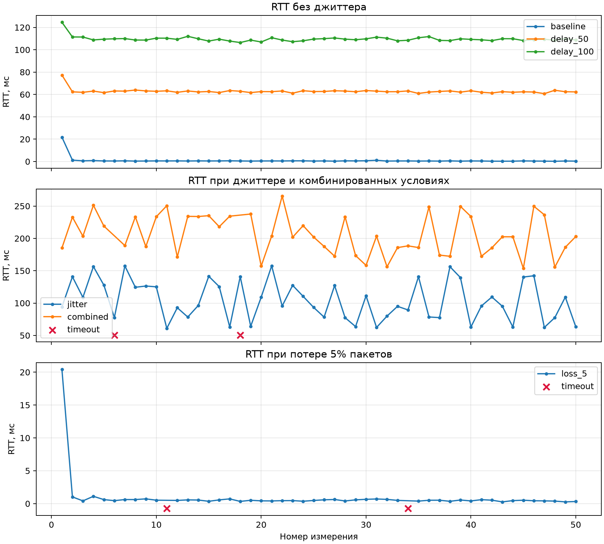
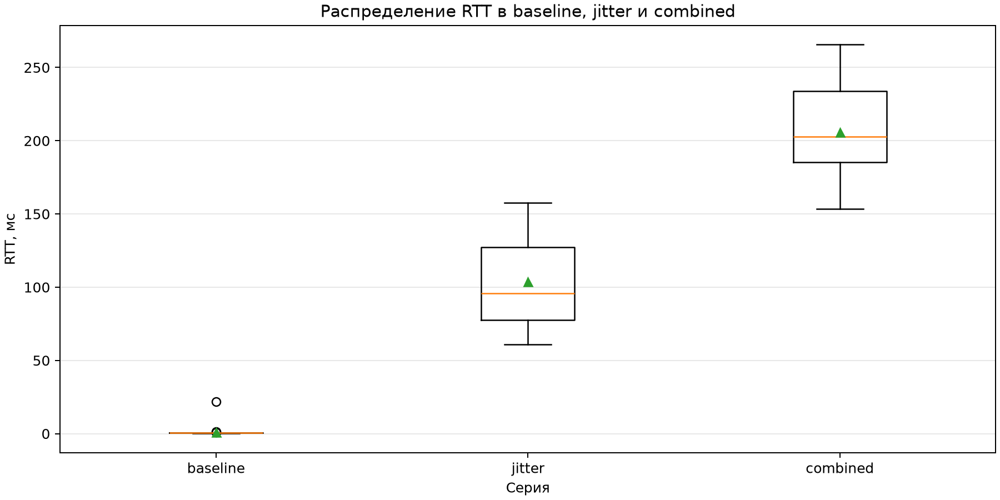
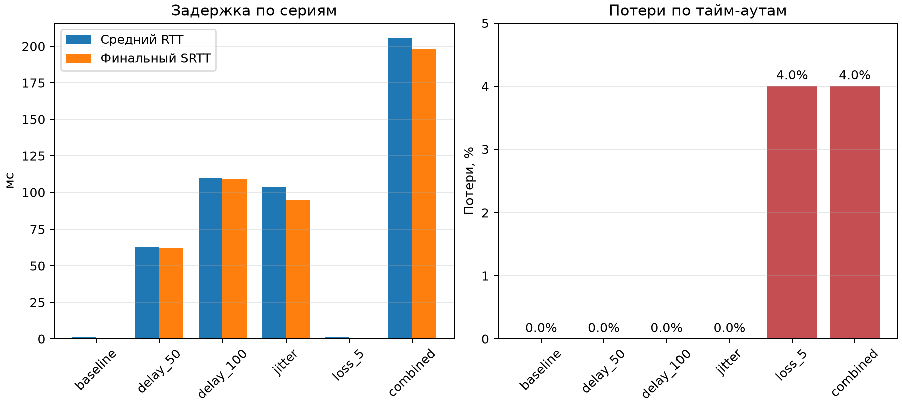

# Отчет о выполнении практической работы №2

## 1. Тема и цель работы

Тема работы: инженерное измерение задержки UDP-соединения.

Цель работы - дополнить UDP-взаимодействие из ПР1 подсистемой телеметрии: измерять время кругового пути пакета (RTT), рассчитывать сглаженный RTT и джиттер, фиксировать потери и обрабатывать нестандартные ответы.

Клиент отправляет пакеты `PING`, сервер возвращает `PONG`, а клиент сохраняет результаты измерений в CSV. Реализация ПР2 расположена в каталоге `PR2` и не изменяет исходные файлы первой практической работы.

## 2. Выбор технологии

Для реализации выбран C# и .NET 8. UDP-обмен выполняется через `UdpClient` из `System.Net.Sockets`, а короткие интервалы измеряются монотонным таймером `Stopwatch`.

Выбор C# обусловлен следующими причинами:

- язык и платформа использовались в ПР1;
- `UdpClient` предоставляет доступ к UDP без ручного управления системными сокетами;
- `Stopwatch` не зависит от изменения системного времени;
- .NET содержит средства работы с байтами, отменой операций и сетевыми адресами;
- проект собирается на Windows с установленным .NET SDK.

Внешние библиотеки и дополнительные NuGet-зависимости не используются.

## 3. Схема измерения

Эксперимент использует схему «клиент - сервер». Клиент отправляет `PING` с порядковым номером и временем отправки. Сервер возвращает `PONG` с тем же номером. RTT вычисляется на стороне клиента:

```text
Клиент  ---> PING --->  UDP-сервер
Клиент  <--- PONG <---  UDP-сервер

RTT = время получения PONG клиентом - время отправки PING клиентом
```

Серверные временные метки записываются в `PONG` только для диагностики. Часы клиента и сервера синхронизировать не требуется.

## 4. Общая структура проекта

Проект состоит из следующих частей:

- `Protocol` - описание и проверка пакетов `PING` и `PONG`;
- `Telemetry` - учет ожидаемых ответов, расчет RTT, SRTT, джиттера и статусов;
- `Transport` - обертка над UDP;
- `Client` - проведение серии измерений и запись CSV;
- `Server` - прием `PING`, эмуляция сетевых условий и отправка `PONG`;
- `Tests` - автоматические проверки протокола и метрик;
- `docs/data` - CSV-файлы шести серий;
- `docs/graphs` - графики и сводная таблица.

## 5. Реализованный UDP-протокол

Каждая UDP-датаграмма содержит один пакет. Все многобайтовые значения передаются в порядке `big-endian`. Заголовок занимает 9 байт.

| Поле | Размер | Назначение |
|---|---:|---|
| Magic | 2 байта | сигнатура протокола `0x4D50` |
| PacketType | 1 байт | тип: `PING` или `PONG` |
| SequenceNumber | 2 байта | порядковый номер пакета |
| PayloadSize | 2 байта | размер полезной нагрузки |
| ProtocolVersion | 2 байта | версия протокола |

`PING` содержит время отправки клиента. `PONG` возвращает это значение и добавляет время приема и отправки на сервере. До чтения полезной нагрузки программа проверяет длину заголовка, сигнатуру, тип, версию, размер и границы буфера. Некорректная датаграмма отбрасывается без аварийного завершения.

## 6. Реализованная логика обмена

Клиент присваивает каждому `PING` уникальный `SequenceNumber`, сохраняет его в `inFlight` и ожидает `PONG` не более 1000 мс. Сервер принимает и проверяет пакет, при необходимости моделирует задержку, джиттер или потерю, затем формирует `PONG` с тем же номером.

Сервер запускается с параметрами:

```text
port delay_ms jitter_min_ms jitter_max_ms loss_rate seed
```

Дробный параметр `loss_rate` читается в инвариантном формате, поэтому значение `0.05` корректно означает вероятность потери 5% и в русской локали Windows.

## 7. Измеряемые показатели

Для каждого запроса фиксируется один из статусов:

- `received` - ответ получен не позднее чем через 1000 мс;
- `timeout` - ответ не получен за 1000 мс;
- `late_response` - ответ получен после тайм-аута;
- `duplicate_response` - повторный ответ;
- `unknown_response` - ответ для неизвестного номера.

После первого успешного измерения сглаженный RTT обновляется по формуле:

```text
SRTT = 0.875 * SRTT + 0.125 * RTT
```

Джиттер равен среднему значению `|RTT_i - RTT_(i-1)|` по соседним успешным ответам. Доля потерь рассчитывается как `timeouts / sent * 100%`. Повторная отправка пакетов в ПР2 не выполняется.

## 8. Ограничения текущего прототипа

Прототип предназначен для измерения UDP-обмена. В нем отсутствуют повторная отправка, подтверждение доставки, упорядочивание пакетов, шифрование и авторизация. Серии выполнены на адресе `127.0.0.1`, поэтому baseline не отражает задержку реальной сети между устройствами.

## 9. Проверка результата и эксперимент

Проекты собираются и проверяются командами:

```powershell
dotnet build Protocol/Protocol.csproj -c Release
dotnet build Telemetry/Telemetry.csproj -c Release
dotnet build Transport/Transport.csproj -c Release
dotnet build Server/Server.csproj -c Release
dotnet build Client/Client.csproj -c Release
dotnet run --project Tests/Tests.csproj -c Release
```

Для каждой серии отправлено 50 `PING` с интервалом 200 мс. Использованы режимы `baseline`, `delay_50`, `delay_100`, `jitter`, `loss_5` и `combined`. Исходные строки находятся в [docs/data](data), а рассчитанные показатели - в [graphs/summary.csv](graphs/summary.csv).

| Серия | Получено / отправлено | Mean RTT, мс | Финальный SRTT, мс | Джиттер, мс | Потери |
|---|---:|---:|---:|---:|---:|
| baseline | 50 / 50 | 0,952 | 0,444 | 0,565 | 0% |
| delay_50 | 50 / 50 | 62,848 | 62,365 | 1,197 | 0% |
| delay_100 | 50 / 50 | 109,633 | 109,211 | 1,500 | 0% |
| jitter | 50 / 50 | 103,865 | 95,028 | 37,619 | 0% |
| loss_5 | 48 / 50 | 0,934 | 0,459 | 0,557 | 4% |
| combined | 48 / 50 | 205,656 | 198,074 | 36,424 | 4% |

Линейный график показывает RTT по номеру измерения. Красные кресты обозначают тайм-ауты, для которых значение RTT отсутствует.



Диаграмма ниже показывает распределение успешных измерений в трех сериях, требуемых методичкой: `baseline`, `jitter` и `combined`.



Сводная диаграмма сравнивает средний RTT и финальный SRTT во всех шести сериях, а также долю потерь по тайм-аутам.



Фиксированная задержка увеличила RTT примерно до 63 и 110 мс. Джиттер дал разброс RTT примерно от 61 до 158 мс. В сериях с потерями зафиксировано по два тайм-аута из 50 пакетов, то есть 4%; это близко к заданной вероятности 5% для небольшой выборки.

## 10. Итог

В ПР2 реализована подсистема телеметрии UDP: пакеты `PING` и `PONG`, проверка входных данных, измерение RTT, расчет SRTT и джиттера, фиксация тайм-аутов и сохранение результатов в CSV. Проведены шесть воспроизводимых серий и построены требуемые графики: RTT с тайм-аутами, сравнение `mean RTT`/`SRTT`/`loss rate` и box plot распределения RTT.
