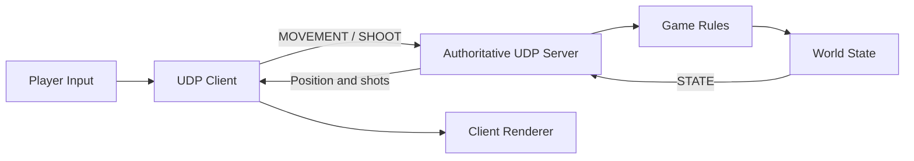

# Архитектура сетевой игры

## Выбранный вариант

Жанр прототипа — сессионный FPS для 2–8 игроков. Топология — выделенный авторитетный сервер (`Dedicated Server`). Сервер является единственным источником истинного состояния мира, а клиенты передают только намерения игрока и отображают полученное состояние.

Выбор подходит для FPS, потому что централизованная обработка команд уменьшает возможности мошенничества и исключает расхождения между несколькими равноправными версиями мира. Цена решения — отдельный процесс сервера и зависимость качества управления от сетевой задержки.

## Схема компонентов

## Обязанности компонентов

| Компонент | Обязанности |
|---|---|
| Player Input | Формирует намерения движения и выстрела |
| UDP Client | Сериализует команды, отправляет их раз в секунду, принимает состояние и контролирует таймаут |
| UDP Server | Проверяет заголовок и размер пакета, распознаёт тип команды, ведёт журнал и отправляет ответ |
| Game Rules | Применяет движение и регистрирует выстрел только на стороне сервера |
| World State | Хранит авторитетные координаты `x`, `y`, `z` и число выстрелов |
| Client Renderer | Отображает подтверждённое сервером состояние; в консольном прототипе выводит его текстом |

## Поток данных

1. Клиент считывает или генерирует команду.
2. Команда сериализуется в сетевой порядок байтов и получает `SequenceNumber`.
3. Сервер валидирует пакет и применяет команду к авторитетному состоянию.
4. Сервер записывает команду в журнал консоли.
5. Сервер возвращает пакет `STATE` с тем же `SequenceNumber`.
6. Клиент выводит номер ответа и новое состояние. Проверка совпадения номера с запросом и адреса отправителя пока отсутствует.

## Границы реализации ПР1

Схема описывает целевую архитектуру FPS. В прототипе сервер хранит одно общее состояние `PlayerState` для всех отправителей, клиент автоматически генерирует команды. Отдельные классы мира, серверного менеджера и графического рендерера предстоит выделить при развитии проекта.

## Дальнейшее развитие

Для игрового проекта прототип можно дополнить идентификатором игрока, серверным тиком, проверкой повторных номеров, снапшотами мира, интерполяцией на клиенте, CRC32 и аутентификацией. Эти механизмы не входят в обязательный минимум первой практической работы.
